  

  
  
  

<b>React &amp; TypeScript · Node.js &amp; Express · Python &amp; FastAPI · SQL</b>

Open to software development internships and graduate opportunities.

## A little about me

I'm **Md Raish**, a B.Tech Computer Science student at **Amity University, Jharkhand (2023–2027)**. I enjoy turning practical problems into working software: responsive interfaces, useful dashboards, REST APIs, and the databases behind them.

| At a glance | What I'm working toward |
| :--- | :--- |
| **Building** | Full-stack applications with clear workflows and reliable APIs |
| **Exploring** | Sentiment analysis of user reviews using NLP and machine learning |
| **Strengthening** | Data structures, SQL, API design, and authentication |
| **Experience** | Full Stack Development Intern at Thiranex Technologies · Apr–May 2026 |

## Selected projects

  
  

**[Live Demo](https://flowops-274o.onrender.com) · [Repository](https://github.com/Mdraish786/FlowOps) · Deployed on Render**

An approval workspace for company requests such as equipment, software access, expenses, and leave. Employees submit requests, approvers review them in sequence, and everyone can follow the request status.

- Role-based access, amount-based approval routing, and request timelines.
- Comments, notifications, private attachments, and audit history.
- **Tech stack:** React · TypeScript · Python · FastAPI · PostgreSQL · SQLAlchemy · Redis · Celery

---

  
  

**[Live Demo](https://postmark-7jfj.onrender.com) · [Repository](https://github.com/Mdraish786/Postmark) · Deployed on Render**

A URL shortener with user accounts, a personal dashboard, and per-link click analytics. Visitors can shorten a link without signing up, while registered users can manage their own links and view click activity.

- JWT authentication and bcrypt password hashing.
- Personal link dashboards, click counts, and timestamped activity logs.
- Server-side ownership checks for viewing analytics and deleting links.
- **Tech stack:** Python · FastAPI · SQLAlchemy · SQLite · HTML · CSS · JavaScript

[Explore all repositories ↗](https://github.com/Mdraish786?tab=repositories)

## My toolbox

| Area | Technologies |
| :--- | :--- |
| **Frontend** | React · JavaScript / TypeScript · HTML5 · CSS3 · Bootstrap |
| **Backend & APIs** | Node.js · Express.js · Python · FastAPI · Pydantic · REST APIs |
| **Databases** | PostgreSQL · MySQL · SQLite |
| **Data & ML** | pandas · NumPy · scikit-learn · Matplotlib |
| **Developer tools** | Git · GitHub · Postman · VS Code |
| **Also worked with** | Java · C++ |

## Experience & education

**Full Stack Development Intern · Thiranex Technologies** 
April–May 2026

- Built responsive web applications and worked on API integration and database operations.
- Collaborated with mentors on debugging and the software development lifecycle.

**B.Tech · Computer Science and Engineering** 
Amity University, Jharkhand · 2023–2027 · Currently in 7th semester 
CGPA: **7.91**

## Beyond the interface

My current academic project is **Sentiment Analysis of User Reviews using Natural Language Processing and Machine Learning Techniques**. I'm interested in the complete journey: preparing review data, training models, evaluating their performance, and presenting useful results.

I also practice problem-solving and keep improving how I explain technical ideas. Always happy to connect over a useful project or a learning opportunity.

  
<b>GitHub activity & statistics</b>

 

[View my contribution activity](https://github.com/Mdraish786?tab=overview) · [Browse my repositories](https://github.com/Mdraish786?tab=repositories)

  

The optional statistics card is served by a third party and may occasionally be unavailable. My contribution activity is also available directly on GitHub.

 

  
  <a href="mailto:mdraish9216@gmail.com"><b>mdraish9216@gmail.com</b></a> · <a href="https://linkedin.com/in/md-raish"><b>LinkedIn</b></a>

